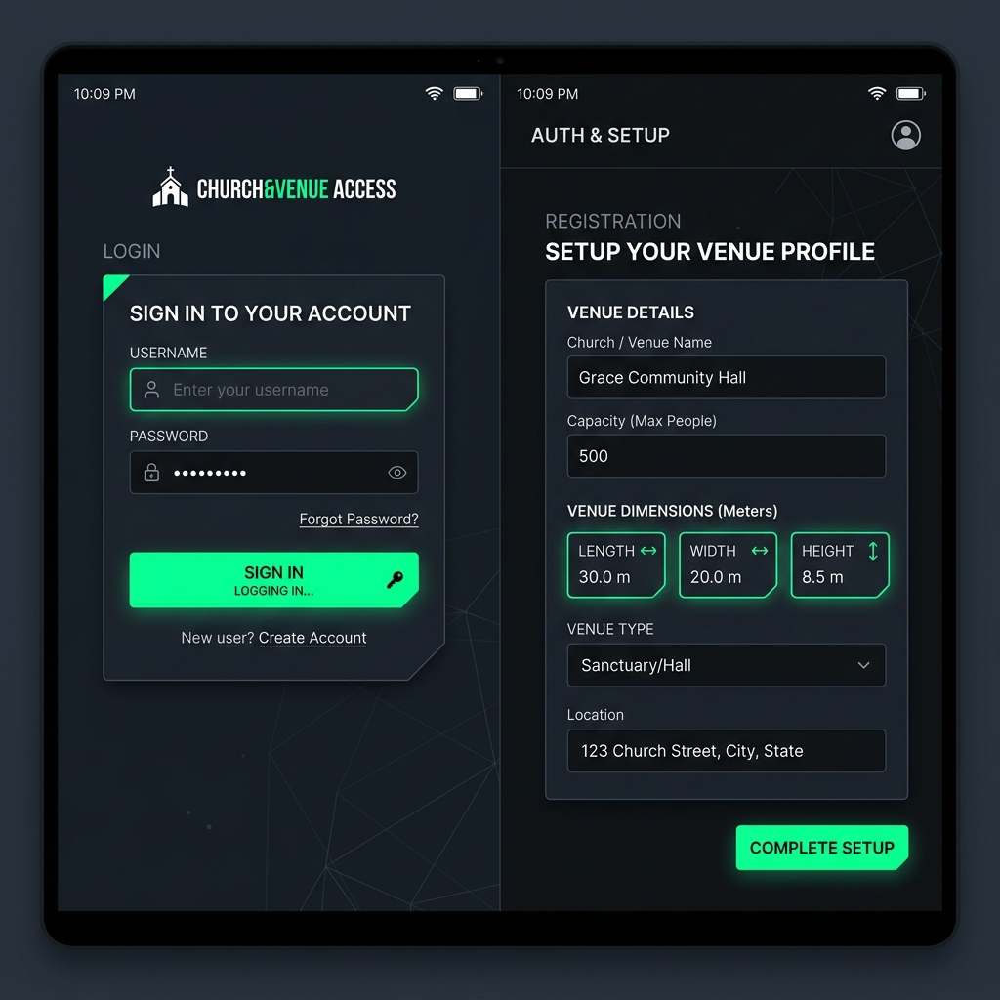
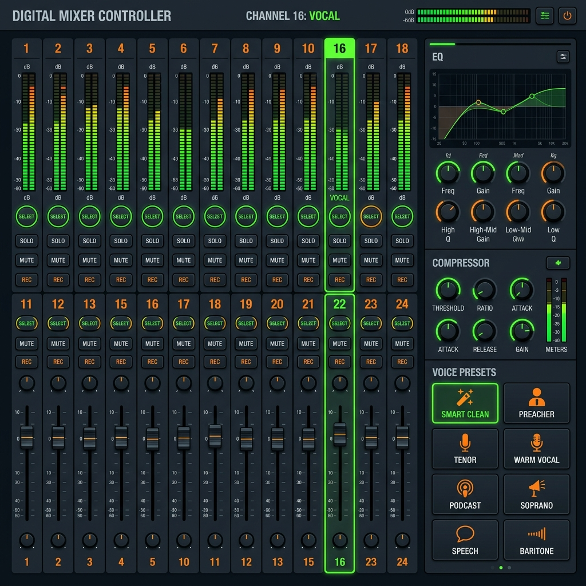
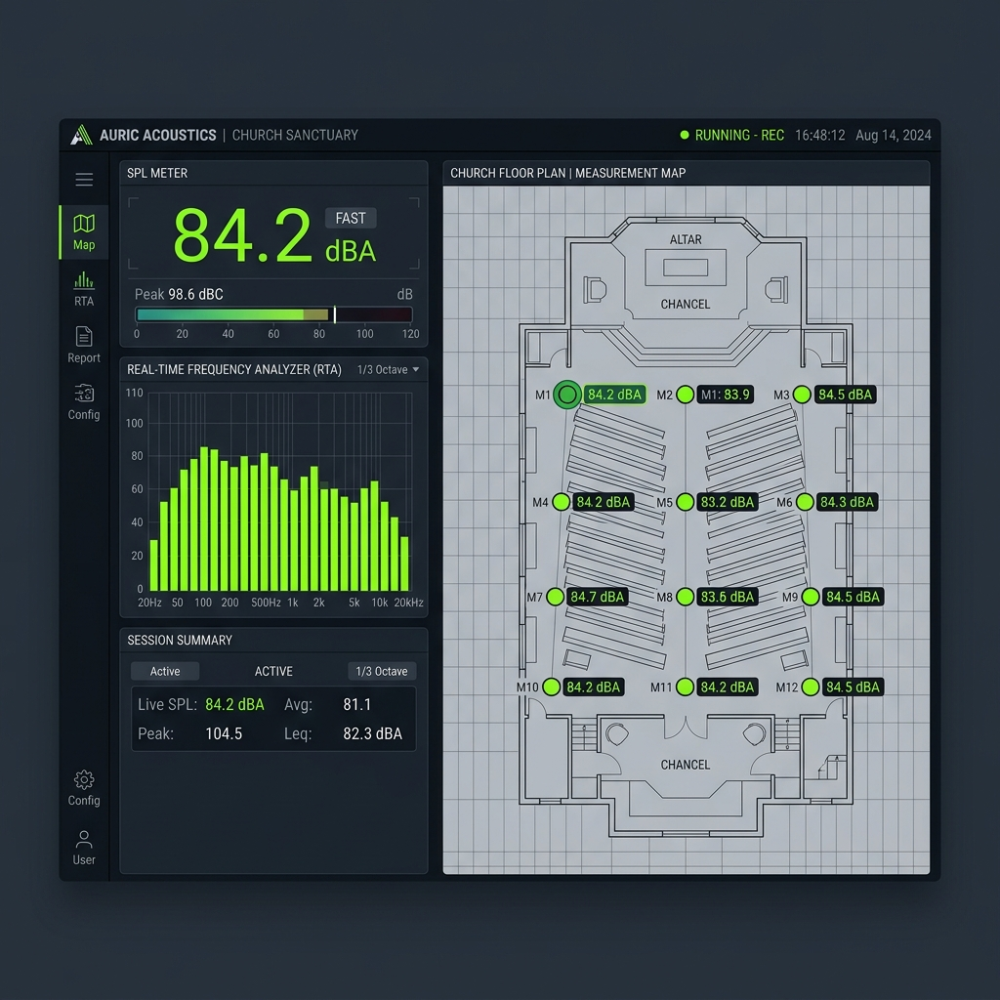
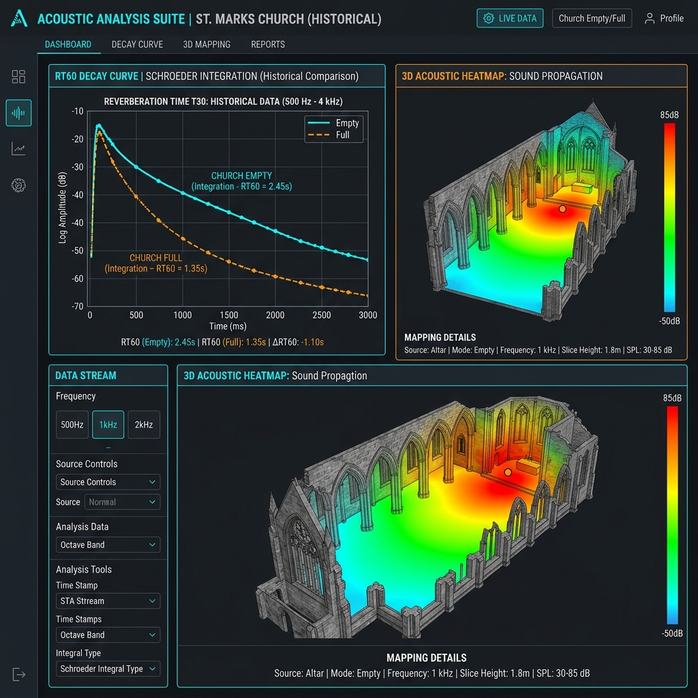

# SoundMaster Pro — Índice de Documentação

## Tutoriais Interativos (Fluxos)

| Fluxo | Descrição | Documentação | Mockup |
|---|---|---|---|
| 🔐 Autenticação | Login, cadastro e configuração do templo | [flow](flows/autenticacao/autenticacao-flow.md) |  |
| 🎚️ Mixer | Conexão e controle da Soundcraft Ui24R | [flow](flows/mixer/mixer-flow.md) |  |
| 📊 Medir | SPL, RTA, calibração e mapeamento espacial | [flow](flows/medir/medir-flow.md) |  |
| 🔬 Analisar | RT60, heatmap 3D e benchmarking | [flow](flows/analisar/analisar-flow.md) |  |
| 🩺 Diagnóstico | Verificação de saúde do sistema | [flow](flows/diagnostico/diagnostico-flow.md) |  |

## Guias Rápidos

- [Primeiros Passos](primeiros-passos.md) — Configuração inicial do app
- [Instalação Avançada](../README.md#instalação) — Build, deploy e variáveis de ambiente

## Arquitetura

- Visão geral no [README](../README.md#estrutura-do-projeto)
- [Assistente de Operação Sonora](ASSISTENTE_OPERACAO_SONORA.md) — captura Main L/R, detectores, modo sombra e contrato de segurança
- [Design System](DESIGN_SYSTEM.md) — tokens, tipografia, cards, controles, acessibilidade e regras para novas telas
- Fluxos de dados: diagramas Mermaid em cada tutorial de fluxo

---

> Os tutoriais interativos estão disponíveis diretamente no app em **Menu → Tutoriais**.
