# SoundMaster — Auto-Mixer Dugan (Grupos A e B)

Este documento descreve o funcionamento do módulo **Auto-Mixer** estilo **Dan Dugan** no ecossistema SoundMaster, detalhando os papéis dos **Grupos A e B**, seus parâmetros e o fluxo de controle de ponta a ponta desde a interface do usuário até a mesa de som física ou simulada.

---

## 1. Visão Geral do Auto-Mixer Dugan
O Auto-Mixer é um algoritmo de controle inteligente de ganho em tempo real que distribui de forma dinâmica a atenuação entre múltiplos microfones abertos. Ele é ideal para painéis, debates e palcos com vários oradores ativos ao mesmo tempo. 

### Objetivos Principais:
* **Prevenir Realimentação (Microfonia)**: Ao atenuar automaticamente canais inativos, o ganho total do sistema é mantido estável, evitando microfonias mesmo com múltiplos canais abertos.
* **Reduzir Ruído de Fundo**: Minimiza o vazamento de ruído ambiente e de reverberação da sala captado por microfones abertos inativos.
* **Transições Naturais**: Oferece transições suaves de nível entre os oradores sem necessidade de intervenção humana constante no fader do canal.

---

## 2. Grupos A e B: Funcionamento e Isolamento
O sistema oferece dois barramentos/grupos independentes de mixagem automática: o **Grupo A** e o **Grupo B**. 

### Casos de Uso comuns:
* **Grupo A (Altar / Púlpito)**: Associado aos microfones principais de pregação e painel fixo.
* **Grupo B (Plateia / Perguntas)**: Associado aos microfones móveis de interação do público.
* **Isolamento**: Canais do Grupo A não interferem no algoritmo de atenuação do Grupo B, mantendo a prioridade do altar intacta independentemente do barulho ou fala vinda da plateia.
* **Desativado (None)**: Canais de música, instrumentos ou reprodução multimídia são mantidos fora do auto-mix para evitar compressão ou cortes indesejados.

---

## 3. Parâmetros de Ajuste

| Parâmetro | Descrição | Faixa de Valores | Padrão |
| :--- | :--- | :--- | :--- |
| **Atribuição de Grupo** | Define a qual barramento o canal pertence. | `A`, `B`, ou `None` | `None` |
| **Peso (Weight / Priority)** | A prioridade relativa do canal no algoritmo de partilha de ganho. Quanto maior, mais ganho o canal retém quando houver fala simultânea. | `0.0` a `1.0` (0% a 100%) | `0.5` |
| **Tempo de Resposta** | A velocidade com que a mesa de som reage e aplica a atenuação. | `20ms` a `4000ms` | `500ms` |
| **Peso Master** | Ajusta simultaneamente o peso de todos os canais do grid para um valor comum. | `0%` a `100%` | `50%` |

## 4. Como Usar o Auto-Mixer na Interface

Para configurar e utilizar o Auto-Mixer através do SoundMaster Pro, siga o guia passo a passo abaixo:

1. **Acessar o Módulo**: No menu de navegação, selecione a opção **Auto-Mixer**.
2. **Ativar os Grupos**:
   * No painel de controle à esquerda, clique nos switches correspondentes ao **Grupo A** e/ou **Grupo B** para ativar a automixagem daquele barramento.
   * Os medidores no topo acenderão o indicador luminoso verde, mostrando que o grupo está ativo.
3. **Associar os Canais aos Grupos**:
   * No grid de canais à direita, clique no botão **A** ou **B** abaixo de cada número do canal para vinculá-lo ao grupo desejado.
   * O contorno do card e os botões mudarão para a cor do grupo correspondente (**Ciano** para A, **Esmeralda** para B).
4. **Habilitar/Desabilitar Canais**:
   * Clique diretamente sobre o card do canal para ativá-lo ou desativá-lo. Apenas canais ativos participam do algoritmo de atenuação.
5. **Configurar Prioridades (Pesos)**:
   * Mova o slider individual de cada canal para ajustar sua prioridade na partilha de ganho.
   * Utilize o slider **Peso Master** no painel de controle lateral se desejar definir uma prioridade base idêntica para todos os canais de uma só vez.
6. **Ajustar Velocidade (Tempo de Resposta)**:
   * Modifique o slider de **Tempo de Resposta** para determinar a velocidade em que a atenuação é aplicada quando um orador faz pausas ou para de falar.
7. **Ações Rápidas**:
   * **Ativar Todos (A)**: Habilita todos os canais para o Grupo A simultaneamente.
   * **Desativar Todos**: Remove a habilitação de todos os canais de uma vez.
   * **Resetar Pesos**: Retorna todas as prioridades dos canais para o valor padrão de 50%.

---

## 5. Fluxo Técnico da Informação

Abaixo está o mapeamento detalhado da comunicação e das mensagens envolvidas no fluxo de controle dos grupos:

```mermaid
sequenceDiagram
    participant UI as Interface (automixer-page.js)
    participant Svc as Client Service (automixer.service.js)
    participant Socket as WebSockets (SocketService)
    participant Handler as Socket Handler (mixer-commands.js)
    participant Actions as Core Actions (mixer-actions.js)
    participant Mixer as Mixer API (Soundcraft Ui)

    %% Cenário 1: Habilitar/Desabilitar Grupo A/B
    rect rgb(30, 41, 59)
        Note over UI, Mixer: Cenário 1: Ligar/Desligar Grupo A ou B
        UI->>Svc: Clique no interruptor do grupo
        Svc->>Socket: SocketService.emit('automix_cmd', { action_type: 'enable_a' })
        Socket->>Handler: Envio WebSocket para o servidor
        Handler->>Actions: executeMixerCommand({ action: 'automix_cmd', action_type: 'enable_a' })
        Actions->>Mixer: am.groups['a'].enable()
        Mixer-->>UI: Retorna log e estado atualizado
    end

    %% Cenário 2: Atribuir Canal e Ajustar Peso
    rect rgb(15, 23, 42)
        Note over UI, Mixer: Cenário 2: Atribuir Canal ao Grupo e Configurar Peso
        UI->>UI: Clique no botão A/B ou ajuste do slider de peso
        Note over UI: Throttle local de 100ms
        UI->>Socket: SocketService.emit('automix_assign', { channel, group, weight })
        Socket->>Handler: Envio WebSocket do par (Grupo, Peso)
        Handler->>Actions: automixAssignChannel(channel, group, weight)
        Actions->>Mixer: input.automixAssignGroup(group)<br/>input.automixSetWeight(weight)
    end
```

---

## 6. Arquivos Envolvidos no Workspace

Se precisar inspecionar ou estender o comportamento do Auto-Mixer, consulte os seguintes arquivos no projeto:

* **Interface e Estilos**:
  * [frontend/pages/automixer.html](file:///c:/Users/Administrator/SoundMaster_IA/frontend/pages/automixer.html) — Contêiner DOM, sliders de peso/tempo de resposta, switches de grupo e grid de canais.
  * [frontend/js/pages/automixer-page.js](file:///c:/Users/Administrator/SoundMaster_IA/frontend/js/pages/automixer-page.js) — Controle de cliques, throttling de envio, e gerenciamento de renderização de redução de ganho.

* **Pontes e Comunicação**:
  * [frontend/js/services/automixer.service.js](file:///c:/Users/Administrator/SoundMaster_IA/frontend/js/services/automixer.service.js) — Interface de alto nível que empacota os comandos e dispara as chamadas via `SocketService`.

* **Servidor (Backend)**:
  * [src/server/handlers/mixer-commands.js](file:///c:/Users/Administrator/SoundMaster_IA/src/server/handlers/mixer-commands.js) — Escuta os sockets `'automix_cmd'` e `'automix_assign'`, validando e encaminhando as chamadas.
  * [src/server/mixer-actions.js](file:///c:/Users/Administrator/SoundMaster_IA/src/server/mixer-actions.js) — Traduz as requisições em chamadas de biblioteca da API Soundcraft Ui (ex: `input.automixAssignGroup(group)` e `input.automixSetWeight(weight)`).
