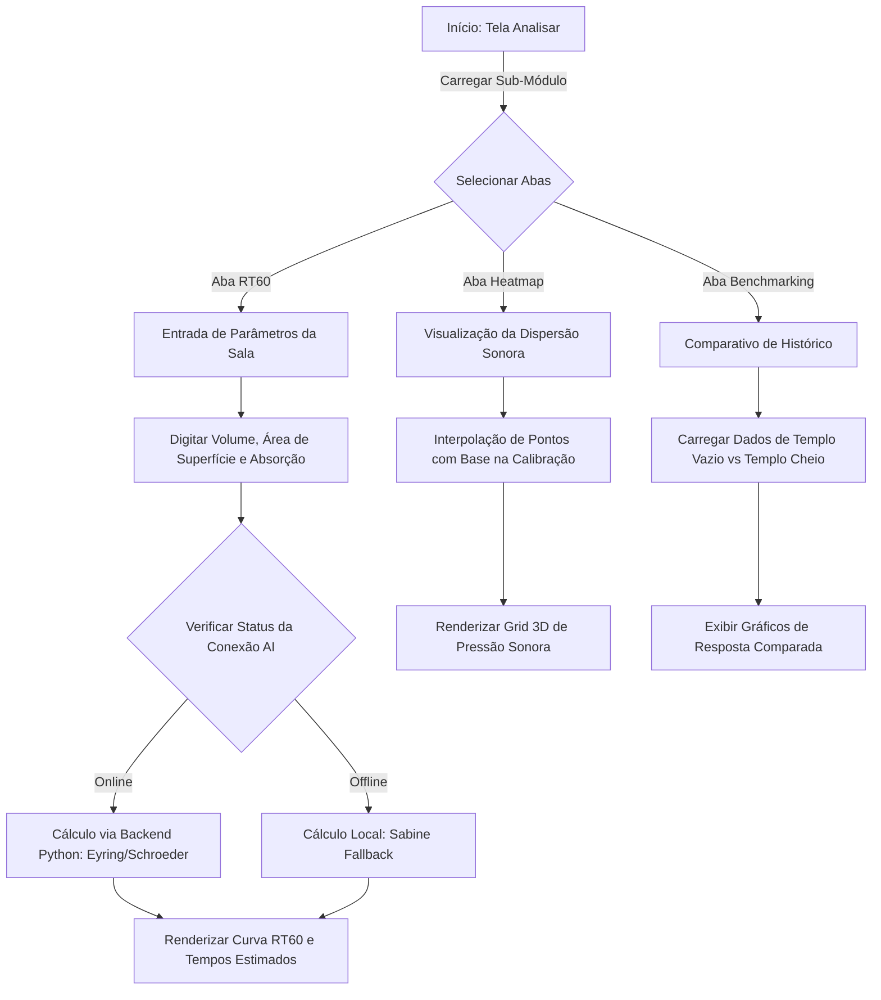

# Módulo Analisar: Mapeamento de Fluxo e Jornada

Este documento detalha o fluxo de telas e ações do usuário na jornada de análise acústica (RT60, Heatmap e Histórico) do **SoundMaster Pro**.

---

## 1. Diagrama de Fluxo (Mermaid)

---

## 2. Jornada do Usuário (Passo a Passo)

1. **Seleção de Abas de Análise:**
   - O usuário pode navegar entre as opções de análise de tempo de reverberação (RT60), mapeamento de dispersão acústica (Heatmap) ou no histórico de medições comparativas (Benchmarking).

2. **Cálculo de RT60 (Calculadora de Reverberação):**
   - O usuário digita as dimensões do templo (Volume em $m^3$ e Área de Superfície em $m^2$).
   - O sistema valida a integridade dos parâmetros digitados para evitar divisões por zero ou resultados negativos.
   - O cálculo é submetido. O processador calcula o tempo de decaimento acústico em bandas de frequência baseando-se no coeficiente médio de absorção dos materiais (Sabine ou Eyring).

3. **Mapeamento Térmico (Heatmap 3D):**
   - O mapa interpola dinamicamente os pontos gravados no módulo "Medir" para estimar a cobertura sonora de todas as áreas do templo.
   - O usuário visualiza zonas de sombra (baixa pressão sonora) ou áreas de cancelamento de fase.

4. **Comparativo Acústico (Benchmarking):**
   - O usuário visualiza o gráfico que compara o comportamento do som em duas situações críticas: templo vazio (com alto tempo de reverberação e reflexões) versus templo cheio (com maior absorção de som gerada pelas pessoas).
   - O gráfico é atualizado dinamicamente via WebSocket sempre que uma nova medição é registrada.

---

## 3. Mockup de Interface
Abaixo está a representação visual da interface do módulo Analisar:

