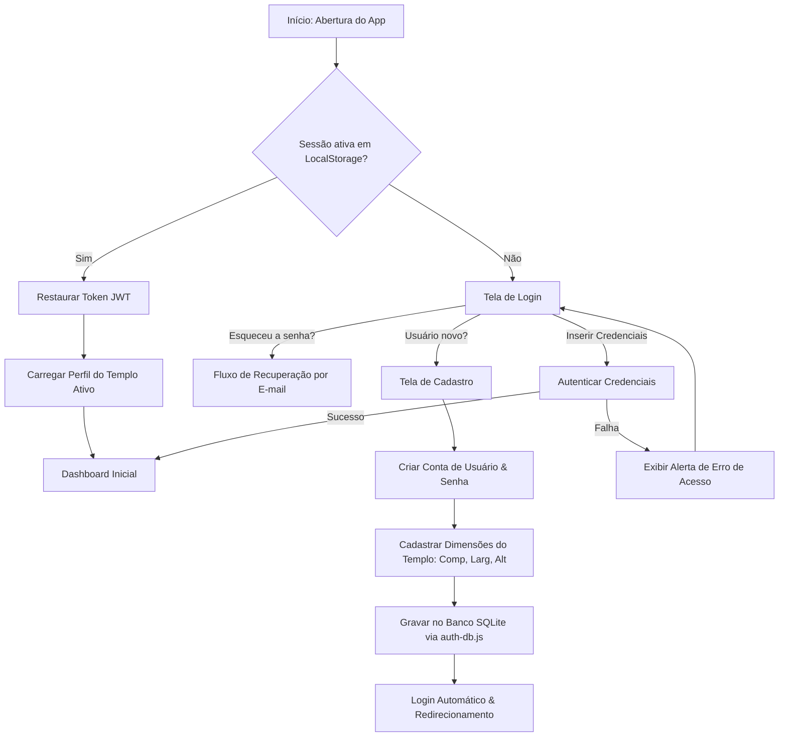

# Módulo Autenticação e Templo: Mapeamento de Fluxo e Jornada

Este documento detalha o fluxo de telas e ações do usuário na jornada de login, registro de templos e sessão do **SoundMaster Pro**.

---

## 1. Diagrama de Fluxo (Mermaid)

---

## 2. Jornada do Usuário (Passo a Passo)

1. **Verificação Inicial de Sessão:**
   - Ao iniciar o aplicativo, a rotina de boot verifica se um token válido de login está guardado no navegador do usuário.
   - Havendo sessão, a navegação é encaminhada direto para a tela principal (Dashboard) sem exigir re-login.

2. **Registro de Novo Templo (Cadastro):**
   - Caso seja a primeira vez de um técnico no aplicativo, ele faz o cadastro básico da sua conta de administrador.
   - O aplicativo exige o registro do templo físico com a inserção das dimensões da igreja (Comprimento, Largura e Altura). Estes valores são cruciais para as calculadoras do módulo "Analisar".

3. **Validação e Armazenamento no Banco de Dados:**
   - As credenciais e senhas criptografadas são enviadas ao servidor Node e registradas no arquivo SQLite local (`auth-db.js`).
   - Após registrar os dados do templo, o usuário ganha acesso irrestrito ao painel de medição e automação.

---

## 3. Mockup de Interface
Abaixo está a representação visual da interface do módulo Autenticação:

