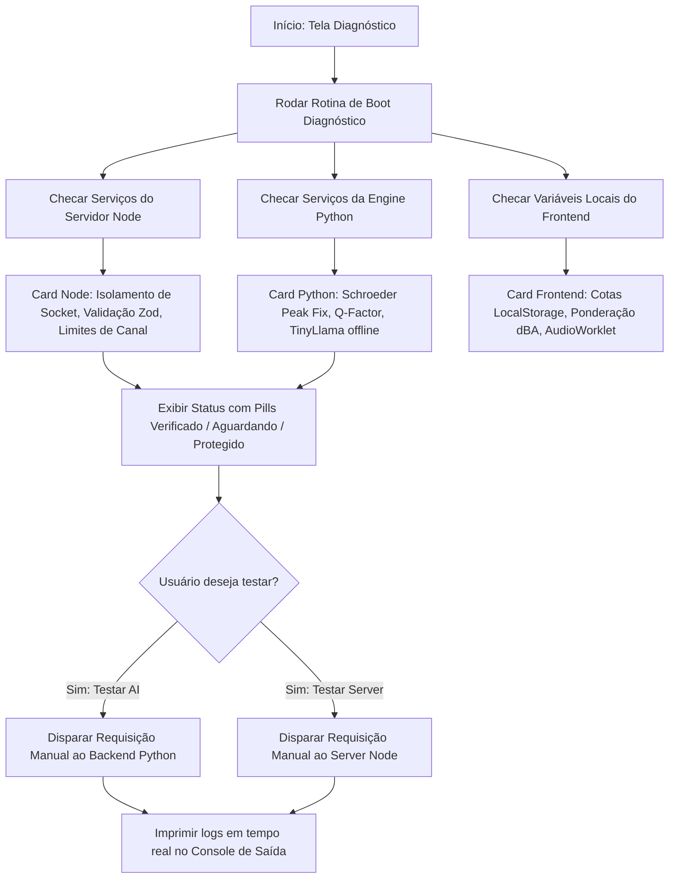
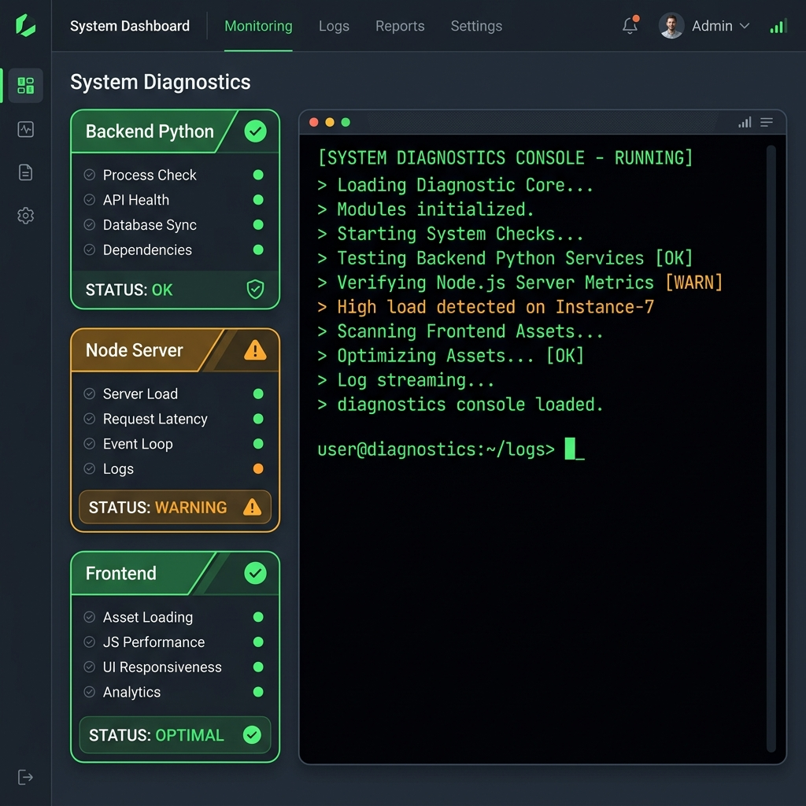

# Módulo Diagnóstico Técnico: Mapeamento de Fluxo e Jornada

Este documento detalha o fluxo de telas e ações do usuário na jornada de diagnóstico interno e monitoramento de serviços do **SoundMaster Pro**.

---

## 1. Diagrama de Fluxo (Mermaid)

---

## 2. Jornada do Usuário (Passo a Passo)

1. **Varredura Automática:**
   - Ao acessar o módulo de Diagnóstico, o sistema roda uma bateria de testes sintéticos imediatos para reportar o estado geral do software.
   
2. **Visualização do Status dos Serviços:**
   - O usuário confere visualmente os cartões dedicados a cada subsistema:
     - **Backend Python:** Apresenta o status das rotinas de processamento de sinal (como o filtro Schroeder e o modelo TinyLlama).
     - **Server Node:** Exibe informações sobre permissões de segurança e validações de portas de rede.
     - **Frontend:** Garante que recursos como o buffer do `AudioWorklet` (4096 amostras) e cotas de armazenamento estão ok.

3. **Verificação sob Demanda:**
   - O usuário pode forçar um teste de integridade clicando nos botões "Testar Conexão AI" ou "Verificar Status Server".
   - A saída detalhada do servidor é impressa linha a linha em um console interativo preto e verde no rodapé da página.

---

## 3. Mockup de Interface
Abaixo está a representação visual da interface do módulo Diagnóstico:

