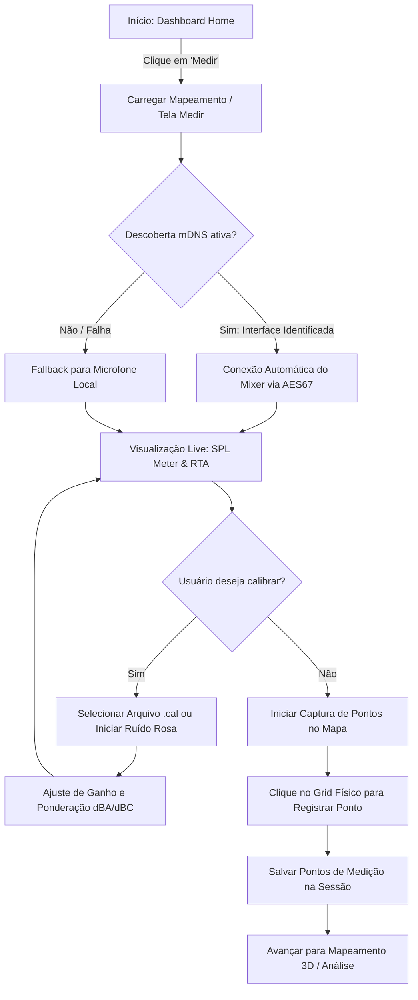

# Módulo Medir: Mapeamento de Fluxo e Jornada

Este documento detalha o fluxo de telas e ações do usuário na jornada de medição acústica em tempo real do **SoundMaster Pro**.

---

## 1. Diagrama de Fluxo (Mermaid)

---

## 2. Jornada do Usuário (Passo a Passo)

1. **Acesso ao Módulo:**
   - O usuário navega para a seção de medição a partir da barra lateral ou da página principal.
   
2. **Conexão e Inicialização do Sinal:**
   - O aplicativo inicia o rastreamento mDNS em segundo plano buscando consoles compatíveis na rede local.
   - Caso um console AES67 seja detectado, o status exibe "Conectado"; caso contrário, o microfone interno do computador/tablet é selecionado automaticamente como canal de entrada padrão.
   
3. **Calibração do Microfone:**
   - Para leituras precisas, o usuário pode fazer upload de um arquivo de calibração do fabricante do microfone (`.cal`). O sistema aplica interpolação linear para corrigir desvios na resposta de frequência.
   
4. **Medição SPL Real-Time:**
   - O usuário visualiza o gráfico do analisador RTA (Real-Time Analyzer) e o visor SPL digital.
   - Ele escolhe a ponderação de curva de ponderação humana (dBA/dBC) e a velocidade de resposta do integrador temporal (FAST para transientes rápidos ou SLOW para níveis médios).
   
5. **Mapeamento Espacial:**
   - O usuário caminha pelo templo e clica nos pontos correspondentes no grid 2D para registrar a assinatura acústica de cada região geográfica.
   - Os dados são transmitidos localmente para a AppStore interna de visualização.

---

## 3. Mockup de Interface
Abaixo está a representação visual da interface do módulo Medir:

