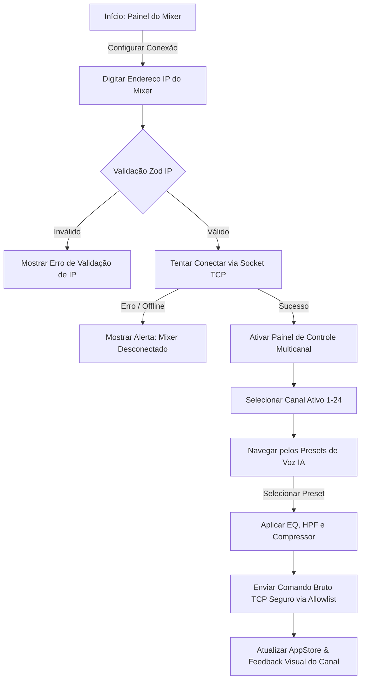

# Módulo Mixer: Mapeamento de Fluxo e Jornada

Este documento detalha o fluxo de telas e ações do usuário na jornada de controle físico e aplicação de processamento no mixer digital integrado ao **SoundMaster Pro**.

---

## 1. Diagrama de Fluxo (Mermaid)

---

## 2. Jornada do Usuário (Passo a Passo)

1. **Configuração da Conexão:**
   - O usuário acessa a página do mixer e insere o IP do console físico na rede local (ex: Behringer X32, Soundcraft UI, etc.).
   - A entrada de IP passa por uma verificação de padrão de formato estrito (Zod Regex) para garantir a segurança das requisições TCP.

2. **Gerenciamento de Canais e Roteamento:**
   - Com o mixer conectado com sucesso, a interface exibe as faixas de canais disponíveis (de 1 a 24).
   - O usuário clica na faixa correspondente para selecionar o canal ativo.

3. **Aplicação de Modelagem por IA (Voice Presets):**
   - O usuário escolhe entre as predefinições de voz inteligentes mapeadas pelo sistema:
     - **Pregador/Fala:** Compressor agressivo para manter volume e voz intelligível.
     - **Smart Clean:** Limpeza inteligente de ruídos com HPF ajustado.
     - **Voz Masculina / Feminina:** Curvas de equalização corretivas baseadas em timbres reais.
     
4. **Envio Seguro de Parâmetros:**
   - O sistema valida a ação contra a `ALLOWED_AI_ACTIONS` no servidor Node.js.
   - Os comandos de equalização e ganho são transmitidos como requisições binárias via protocolo TCP/OSC para o console físico.
   - O canal do mixer reflete a alteração de equalização em tempo real.

---

## 3. Mockup de Interface
Abaixo está a representação visual da interface do módulo Mixer:

